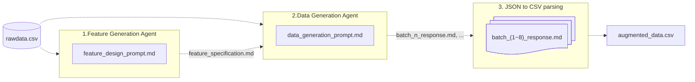

```mermaid
graph LR
    R[(rawdata.csv)]
    subgraph fga[1.Feature Generation Agent]
        direction TB
        fdp[feature_design_prompt.md]
    end
    R -.->fga
    subgraph dga[2.Data Generation Agent]
        dgp
    end
    dgp[data_generation_prompt.md]
    subgraph B["3. JSON to CSV parsing"]
        direction TB
        L@{shape: docs, label: "batch_(1~8)_response.md"}

    end

    
    R -.->dga
    fga -.->|feature_specification.md|dga
    dga -.->|"batch_n_response.md, ..."|B
    B -.-> O[augmented_data.csv]
```