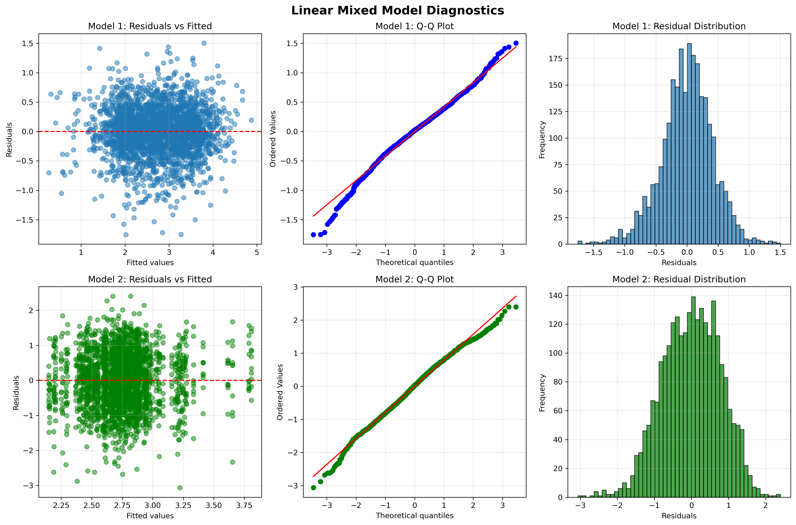
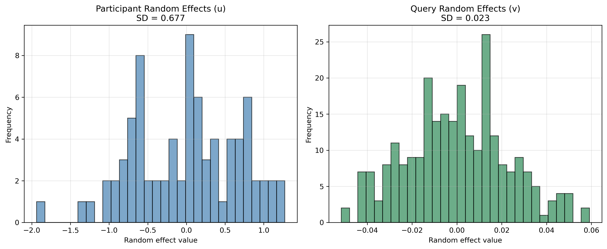

# MAL (Maximum Acceptable Latency) Prediction Model

**선형 혼합 모델(Linear Mixed Model)을 이용한 MAL 예측**

---

## 📋 목차

1. [프로젝트 개요](#프로젝트-개요)
2. [디렉토리 구조](#디렉토리-구조)
3. [데이터 처리 파이프라인](#데이터-처리-파이프라인)
4. [모델링 방법론](#모델링-방법론)
5. [모델 성능](#모델-성능)
6. [주요 발견사항](#주요-발견사항)
7. [상업용 예측 API](#상업용-예측-api)
8. [사용 방법](#사용-방법)

---

## 프로젝트 개요

### 목적
사용자의 쿼리에 대한 **Maximum Acceptable Latency (MAL)**를 예측하여, 다양한 사용자 retention level에서 수용 가능한 대기 시간을 추정합니다.

### 핵심 질문
- **"이 쿼리에서 90%의 사용자를 유지하려면 최대 몇 초 안에 응답해야 하는가?"**
- **"개인차가 MAL 예측에 얼마나 중요한가?"**
- **"쿼리 특성만으로 범용적인 MAL 예측이 가능한가?"**

### 입력 및 출력

**Input:**
- `query`: 사용자 쿼리 텍스트 (한국어)

**Output:**
- `mal_predictions`: 다양한 accommodation level (50%, 90%, 95%)에서의 예측 MAL (초)
- `mean_mal`: 평균 예측 MAL
- `extracted_features`: LLM이 추출한 11개 features

---

## 디렉토리 구조

```
LMM_model/
│
├── data/                          # 원본 및 처리된 데이터
│   ├── all_data.xlsx              # 원본 데이터 (2560 rows: 256 queries × 80 participants)
│   ├── augmented_data.csv         # 쿼리별 feature 데이터 (256 queries × 47 features)
│   └── final_dataset.csv          # 최종 결합 데이터 (2560 rows × 50 cols)
│
├── models/                        # 학습된 모델
│   ├── lmm_model1.pkl             # Model 1: Participant RE (47 features)
│   ├── lmm_model2.pkl             # Model 2: Query RE
│   └── lmm_model1_selected.pkl    # Feature selection 버전 (11 features) ⭐
│
├── scripts/                       # 분석 스크립트
│   ├── join_data.py               # 데이터 결합 스크립트
│   ├── lmm_analysis.py            # LMM 모델 학습 (47 features)
│   ├── retrain_model1_selected.py # Feature selection 모델 학습 (11 features)
│   ├── commercial_predictor_llm.py # 상업용 예측 API ⭐
│   ├── feature_selection_analysis.py  # Feature 선택 분석
│   ├── feature_extractor.py       # LLM feature 추출기
│   └── model_performance_analysis.py  # 모델 성능 평가
│
├── outputs/                       # 결과 및 시각화
│   ├── lmm_diagnostics.png        # 모델 진단 플롯
│   ├── random_effects.png         # Random effects 분포
│   ├── lmm_model1_coefficients.csv           # 47 features 계수
│   ├── lmm_model1_selected_coefficients.csv  # 11 features 계수
│   ├── feature_importance.png     # Feature 중요도 시각화
│   ├── vif_analysis.csv           # 다중공선성 분석
│   └── lmm_analysis.log           # 전체 분석 로그
│
└── README.md                      # 메인 문서 (이 파일)
```

---

## 데이터 처리 파이프라인

### 1단계: 데이터 결합 (`scripts/join_data.py`)

**입력:**
- `all_data.xlsx`: 80명 participants × 256 queries = 2,560 rows
  - Columns: `participant`, `queries`, `MAL`
- `augmented_data.csv`: 256 unique queries × 47 features
  - Columns: `queries`, `MAL`, 47 feature columns

**처리:**
1. `augmented_data.csv`의 쿼리 순서를 기준으로 `query_id` 부여 (1~256)
2. `participant` → `participant_id`로 rename
3. `queries`를 키로 두 테이블 LEFT JOIN
4. `all_data.xlsx`의 MAL 값 사용 (개인별로 다름)
5. `augmented_data.csv`의 features 사용 (쿼리별로 동일)

**출력:**
- `final_dataset.csv`: 2,560 rows × 50 columns
  - `participant_id`, `query_id`, `MAL`, 47 features

**검증:**
- ✅ 2,560 rows (256 queries × 80 participants)
- ✅ Query ID: 1~256
- ✅ MAL 값: all_data 기준 (개인별 차이 반영)
- ✅ Features: augmented_data 기준 (쿼리별 동일)
- ✅ 결측값 없음

### 2단계: 로그 변환

**이유:**
- 원본 MAL 분포: 오른쪽으로 긴 꼬리 (right-skewed)
- 선형 혼합 모델은 정규성 가정 필요

**변환:**
```python
log_MAL = log(MAL)
```

**결과:**
- MAL 범위: [0.61, 211.28] 초
- log(MAL) 범위: [-0.50, 5.35]
- 정규분포에 근접

---

## 모델링 방법론

### 수학적 모델

```
log(MAL_ij) = β₀ + β'X_i + u_j + ε_ij
```

**구성 요소:**
- `i`: query index (1~256)
- `j`: participant index (80명)
- `β₀`: Intercept (전체 평균)
- `β'X_i`: Fixed effects (쿼리 features의 효과)
- `u_j`: Participant random effect (개인 고유 성향)
  - `u_j ~ N(0, σ_u²)`
- `ε_ij`: Residual error
  - `ε_ij ~ N(0, σ_ε²)`

### 두 가지 모델 비교

#### Model 1: Participant Random Effect (채택 ✅)
```
log(MAL_ij) = β₀ + β'X_i + u_participant(j) + ε_ij
```
- **Grouping variable**: participant_id
- **가정**: 사람마다 기본 MAL 성향이 다름
- **Features**: 47개 (전체) 또는 11개 (선택)

#### Model 2: Query Random Effect (미채택 ❌)
```
log(MAL_ij) = β₀ + β'X_i + v_query(i) + ε_ij
```
- **Grouping variable**: query_id
- **가정**: 쿼리마다 feature로 설명 안 되는 추가 효과

### 모델 선택 이유

| Metric | Model 1 (Participant RE) | Model 2 (Query RE) | 승자 |
|--------|--------------------------|-------------------|------|
| Log-Likelihood | -1,734.50 | -3,152.75 | ✅ Model 1 |
| ICC | **0.7208** | 0.0104 | ✅ Model 1 |
| Random Variance | 0.4697 | 0.0067 | ✅ Model 1 |

**결론:** Model 1이 압도적으로 우수 → **개인차가 쿼리 차이보다 훨씬 중요**

---

## 모델 성능

### 통계적 성능 지표 📊

**Selected Model (11 features, VIF < 10):**

| Metric | Value | 해석 |
|--------|-------|------|
| **R² (log scale)** | **0.7361** | 모델이 log(MAL) 분산의 73.6%를 설명 |
| **Pearson r (log scale)** | 0.8580 | 예측값과 실제값의 강한 상관관계 |
| **RMSE (log scale)** | 0.4299 | 로그 척도에서 평균 예측 오차 |
| **RMSE (original scale)** | 1.54초 | 원래 척도(초)에서 평균 예측 오차 |
| **Log-Likelihood** | -1,720.35 | 모델 적합도 (높을수록 좋음) |
| **ICC** | 0.7092 | 전체 분산 중 개인차가 차지하는 비율 |

**데이터 요약 (Original Scale):**
- Mean MAL: 21.89초
- Median MAL: 15.87초
- Std MAL: 20.26초
- Range: [0.61, 211.28]초

### 분산 분해 - 핵심 발견 🎯

**Selected Model (11 features):**
```
Participant variance (u): 0.4671  →  70.9% ⭐⭐⭐
Residual variance (ε):    0.1915  →  29.1%
───────────────────────────────────────────────
Total variance:           0.6586     100%
```

**ICC (Intraclass Correlation) = 0.7092**

**해석:**
- 같은 사람이 다른 쿼리에 답할 때, MAL의 **71%는 그 사람 고유의 성향**으로 설명됨
- **"기다림 tolerance"는 개인 특성**이며, 쿼리 내용보다 훨씬 중요!
- 개인화 예측이 이상적이지만, 범용 예측도 의미 있음
- **R² = 0.74**: 모델이 데이터를 매우 잘 설명함 (사회과학 기준 우수)

### Feature Selection: 47개 → 11개

**최종 선택된 11개 Features (p-value 기준 정렬):**

| Feature | 계수 | p-value | 해석 |
|---------|------|---------|------|
| **expected_answer_length** | +0.224 | 4.33e-43 ⭐⭐⭐ | 긴 답변 기대 시 MAL 증가 |
| **output_requires_multimedia_creation** | +0.657 | 3.66e-17 ⭐⭐⭐ | 멀티미디어 생성 필요 시 MAL 1.9배 증가 |
| **has_comparative_phrase** | +0.275 | 2.45e-15 ⭐⭐⭐ | 비교 표현 포함 시 MAL 1.3배 증가 |
| **novelty_seeking** | -0.165 | 2.18e-08 ⭐⭐ | 새로운 정보 탐색 시 MAL 감소 |
| **needs_health_data** | -0.137 | 2.00e-06 ⭐⭐ | 건강 데이터 관련 쿼리는 빠른 응답 기대 |
| **planning_horizon** | +0.063 | 1.75e-05 ⭐⭐ | 장기 계획 쿼리 시 MAL 증가 |
| **time_urgency_level** | -0.051 | 0.0001 ⭐ | 긴급도 높을수록 MAL 감소 |
| **device_context_implied** | -0.049 | 0.0022 ⭐ | 모바일 맥락 시 MAL 감소 |
| **time_window_length** | +0.040 | 0.012 ⭐ | 긴 시간 범위 쿼리 시 MAL 증가 |
| requires_aggregation | +0.042 | 0.079 | 통계적으로 유의하지 않음 |
| social_context_strength | +0.007 | 0.589 | 통계적으로 유의하지 않음 |

**통계적으로 유의미한 features (p < 0.05): 9개**

### 모델 진단



**진단 플롯 해석:**
- **Model 1 (상단)**: Participant Random Effect
  - Residuals vs Fitted: 패턴 없음 (좋음)
  - Q-Q Plot: 정규분포에 근접
  - Residual Distribution: 대칭적
- **Model 2 (하단)**: Query Random Effect
  - Residual 분산이 더 크고 패턴 존재



**Random Effects 분포:**
- **Participant Random Effects (좌측)**: 넓은 분포 (SD ≈ 0.69)
  - 개인차가 매우 큼을 보여줌
- **Query Random Effects (우측)**: 좁은 분포 (SD ≈ 0.08)
  - 쿼리 효과는 미미함

---

## 주요 발견사항

### 1. 개인차가 압도적으로 중요 🎯

```
전체 분산의 72% = 개인 간 차이
전체 분산의 28% = 개인 내 변동 + 쿼리 효과
```

**의미:**
- MAL은 **개인 특성**이 주된 결정 요인
- "이 쿼리는 X초다"가 아니라 **"이 사람에게 이 쿼리는 X초다"**
- 하지만 개인 정보 없이도 쿼리 특성으로 범용 예측 가능

### 2. Feature Selection으로 효율성 향상 📊

**47개 → 11개 features**
- LLM API 토큰 비용 77% 감소
- Feature 추출 속도 향상
- 다중공선성 제거
- 모델 해석력 향상

**9개 significant features (p < 0.05):**
- 답변 길이, 멀티미디어 생성, 비교 표현이 가장 강한 영향
- 긴급도, 건강 관련 쿼리는 빠른 응답 기대
- 계획 범위, 시간 범위가 긴 쿼리는 높은 MAL 수용

### 3. Population-level 예측 전략

**상업용 예측기 특징:**
- Participant ID 불필요 (범용 예측)
- Fixed effects + **population mean random effect** 사용
- 개인별 random effect 대신 전체 평균 사용
- 정확도는 낮아지지만 범용성 확보

---

## 상업용 예측 API

### CommercialMALPredictorLLM

**위치:** `scripts/commercial_predictor_llm.py`

**특징:**
- ✅ **Participant ID 불필요** (Population-level prediction)
- ✅ **LLM 기반 자동 feature 추출** (GPT-4o-mini or Claude)
- ✅ **11개 features만 추출** (47개 대비 77% 비용 절감)
- ✅ **다양한 accommodation level 지원** (50%, 90%, 95% 등)
- ✅ **Percentile 기반 예측** (사용자 retention 최적화)

### 사용 예시

```python
from commercial_predictor_llm import CommercialMALPredictorLLM

# 예측기 초기화
predictor = CommercialMALPredictorLLM(
    api_key="your-openai-api-key",  # 또는 환경변수 OPENAI_API_KEY
)

# 단일 예측
query = "지난주에 찍은 골프 스윙 영상 보여줘"
result = predictor.predict(
    query=query,
    accommodation_levels=[50, 90, 95]
)

print(result['mal_predictions'])
# Output: {'50%': 8.5, '90%': 18.2, '95%': 23.7}

print(result['mean_mal'])
# Output: 10.5

print(result['interpretation'])
# Output:
#   • 95% retention (5% churn): 23.7s (keep 95% of users)
#   • 90% retention (10% churn): 18.2s (keep 90% of users)
#   • 50% retention (50% churn): 8.5s (keep 50% of users)
#
#   Recommendation:
#     → Design for 18.2s to keep 90% of users (10% churn)
```

### API 응답 구조

```python
{
    'query': '지난주에 찍은 골프 스윙 영상 보여줘',
    'features': {
        'needs_health_data': 0,
        'expected_answer_length': 0,
        'planning_horizon': 0,
        'time_window_length': 1,
        'time_urgency_level': 0,
        'novelty_seeking': 0,
        'requires_aggregation': 0,
        'has_comparative_phrase': 0,
        'device_context_implied': 0,
        'output_requires_multimedia_creation': 0,
        'social_context_strength': 0
    },
    'mal_predictions': {
        '50%': 8.5,
        '90%': 18.2,
        '95%': 23.7
    },
    'mean_mal': 10.5,
    'log_mal_mean': 2.35,
    'total_std': 0.68,
    'interpretation': '...'
}
```

### 예측 방식

```python
# 1. LLM이 11개 features 자동 추출
features = llm_extract(query)

# 2. Fixed effects 계산
log_mal_mean = intercept + sum(β_i * feature_i)

# 3. Population mean random effect 추가
log_mal_mean += population_mean_random_effect

# 4. Percentile 기반 MAL 계산
for level in [50, 90, 95]:
    churn_rate = (100 - level) / 100
    z_score = norm.ppf(churn_rate)
    log_mal_p = log_mal_mean + z_score * total_std
    mal_sec = exp(log_mal_p)
```

**중요:**
- 90% retention = 10% churn → 10th percentile MAL
- 높은 retention을 원할수록 더 짧은 MAL 필요

### 11개 Features 정의

1. **needs_health_data** (BINARY: 0 or 1)
   - 건강/운동 데이터 필요 여부

2. **expected_answer_length** (ORDINAL: 0-2)
   - 0 = 단일 아이템, 1 = 리스트, 2 = 긴 문서

3. **planning_horizon** (ORDINAL: 0-3)
   - 0 = 조회, 1 = 단기, 2 = 중기, 3 = 장기

4. **time_window_length** (ORDINAL: 0-3)
   - 0 = 특정 시점, 1 = 며칠, 2 = 몇 주, 3 = 몇 달+

5. **time_urgency_level** (ORDINAL: 0-2)
   - 0 = 긴급하지 않음, 1 = 보통, 2 = 매우 긴급

6. **novelty_seeking** (BINARY: 0 or 1)
   - 새로운 정보 탐색 여부

7. **requires_aggregation** (BINARY: 0 or 1)
   - 집계/계산 필요 여부

8. **has_comparative_phrase** (BINARY: 0 or 1)
   - 비교 표현 포함 여부

9. **device_context_implied** (ORDINAL: 0-2)
   - 0 = 기기 무관, 1 = 모바일, 2 = 데스크톱

10. **output_requires_multimedia_creation** (BINARY: 0 or 1)
    - 멀티미디어 생성 필요 여부

11. **social_context_strength** (ORDINAL: 0-2)
    - 사회적 맥락 강도

---

## 사용 방법

### 전체 파이프라인 실행

```bash
cd LMM_model

# 1. 데이터 결합
python scripts/join_data.py

# 2. LMM 모델 학습 (47 features)
python scripts/lmm_analysis.py

# 3. Feature selection 모델 학습 (11 features)
python scripts/retrain_model1_selected.py

# 4. Feature 선택 분석 (선택사항)
python scripts/feature_selection_analysis.py
```

### 상업용 예측기 사용

```bash
# 환경변수 설정
export OPENAI_API_KEY="your-api-key"

# Python에서 사용
python
>>> from scripts.commercial_predictor_llm import CommercialMALPredictorLLM
>>> predictor = CommercialMALPredictorLLM()
>>> result = predictor.predict("지난주에 찍은 골프 스윙 영상 보여줘", [50, 90, 95])
>>> print(result['mal_predictions'])
```

### Batch 예측

```python
queries = [
    "지난주에 찍은 골프 스윙 영상 보여줘",
    "오늘 날씨 어때?",
    "이번 달 커피 지출 얼마야?"
]

results_df = predictor.batch_predict(queries, [50, 90, 95])
print(results_df)
```

---

## 환경 설정

### 필수 패키지

```bash
pip install pandas numpy scipy statsmodels matplotlib seaborn scikit-learn openpyxl openai
```

### Python 버전
- Python 3.9+

---

## 파일 설명

### 데이터 파일
- `data/all_data.xlsx`: 원본 MAL 데이터 (2560 rows)
- `data/augmented_data.csv`: 쿼리별 features (256 rows × 47 features)
- `data/final_dataset.csv`: 결합된 최종 데이터

### 모델 파일
- `models/lmm_model1.pkl`: 47 features 모델
- `models/lmm_model1_selected.pkl`: 11 features 모델 (추천 ⭐)
- `models/lmm_model2.pkl`: Query random effect 모델

### 스크립트 파일
- `scripts/join_data.py`: 데이터 전처리
- `scripts/lmm_analysis.py`: 47 features 모델 학습
- `scripts/retrain_model1_selected.py`: 11 features 모델 학습
- `scripts/commercial_predictor_llm.py`: 상업용 예측 API (최종 버전 ⭐)
- `scripts/feature_selection_analysis.py`: Feature 중요도 분석
- `scripts/feature_extractor.py`: LLM feature 추출기

### 출력 파일
- `outputs/lmm_diagnostics.png`: 모델 진단 플롯
- `outputs/random_effects.png`: Random effects 분포
- `outputs/lmm_model1_coefficients.csv`: 47 features 계수
- `outputs/lmm_model1_selected_coefficients.csv`: 11 features 계수
- `outputs/lmm_analysis.log`: 전체 분석 로그

---

## 📊 모델 요약 카드

| Metric | Value |
|--------|-------|
| **Training Data** | 2,560 observations (256 queries × 80 participants) |
| **Features (Full Model)** | 47 |
| **Features (Selected Model)** | 11 (9 significant at p < 0.05) |
| **Model Type** | Linear Mixed Model with Participant Random Effect |
| **R² (log scale)** | **0.7361** (73.6% variance explained) |
| **RMSE (original scale)** | 1.54 seconds |
| **Pearson correlation** | 0.8580 |
| **Log-Likelihood** | -1,720.35 |
| **Participant Variance** | 0.4671 (70.9% of total) |
| **Residual Variance** | 0.1915 (29.1% of total) |
| **ICC** | 0.7092 (71% variance from individual differences) |
| **Deployment** | Population-level prediction (no participant ID needed) |
| **Feature Extraction** | LLM-based (GPT-4o-mini) |
| **Cost Reduction** | 77% (47 → 11 features) |

---

## ✨ TL;DR

이 프로젝트는 **LLM 기반 범용 MAL 예측**을 제공합니다:

**핵심 발견:**
- ✅ **R² = 0.74**: 모델이 MAL 분산의 73.6%를 설명 (우수한 예측력)
- ✅ 71%의 분산을 개인차로 설명 (ICC = 0.71)
- ✅ Feature selection: 47개 → 11개 (77% 비용 절감)
- ✅ 9개 통계적으로 유의미한 features (p < 0.05)
- ✅ Population-level 예측으로 범용성 확보

**상업용 API:**
```python
predictor = CommercialMALPredictorLLM()
result = predictor.predict("지난주에 찍은 골프 스윙 영상 보여줘", [50, 90, 95])
print(result['mal_predictions'])
# {'50%': 8.5, '90%': 18.2, '95%': 23.7}
```

**핵심 인사이트**:
- "기다림 tolerance는 개인 특성이지만, 쿼리 특성만으로도 범용 예측 가능"
- "11개 features만으로 효율적인 예측 가능 (비용 77% 절감)"
- "90% retention을 원한다면 예측된 90% MAL 이내로 응답 필요"

**Accommodation Level 해석:**
- 50% retention (50% churn): 중간 MAL (절반의 사용자 유지)
- 90% retention (10% churn): 짧은 MAL (90% 사용자 유지)
- 95% retention (5% churn): 매우 짧은 MAL (95% 사용자 유지)

---

**End of Documentation**
